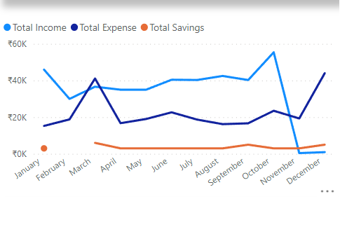

# MyFi Analysis Project *(Excel, Power BI)*
## Project Overview
The following is a personal finance data analysis project where I analyzed my spending patterns, income sources and financial health. I used data visualization and descriptive statistics to gain insights into the data. The goal is to identify areas where I can save money and make better financial decisions.
## Objectives
- To work on a real-world data and save money.
- Embed Analytics into daily life.
- Financial Literacy at early age.
### Questions that drive the Analysis:
- What is my spending pattern?
- Which months are financially good or bad?
- Where does most amount of my money go?
- What is my net worth?
### Cleaning and preparation:
- The data for this project can also be collected from a personal finance tracking app or spreadsheet. The data will include date, description, category, amount and income/expense/savings variables.
- You can see the raw data in this [Link](https://github.com/subhojitdas859/MyFi_Analysis_Project/blob/main/files/MyFi%20Spreadsheet.xlsx) As you can see in the image below, the format of the data was not appropriate for the analysis, so it had to be cleaned and prepared.

The activities performed were the following:
- Eliminate duplicates and cells that did not correspond to the data.
- Adjust the dates because they did not have the proper format.
- Created the date, values and categiry columns for the analysis.
 

### Data analysis:

1. Where does most amount of my earnings go?

2. Which months are financially good or bad?

3. What is my spending pattern?

### Visualization:
Finally we obtained a dashboard showing the sales in a general way and the other one showing the performance of these at different times of the day and weeks. You can see the dashboard below and you can access the document by clicking on this [Link](https://github.com/subhojitdas859/MyFi_Analysis_Project/tree/main/files)

[Link to files](https://github.com/subhojitdas859/MyFi_Analysis_Project/tree/main/files)
## Conclusions
- Identification of trends and insights: Identified key trends and insights in personal finance data, such as spending patterns and investment performance, and provided actionable recommendations to improve financial health.
- Improved financial outcomes: As a result of my analysis and recommendations, I was able to achieve improved financial outcomes, including increased savings, reduced debt, and greater investment returns.
